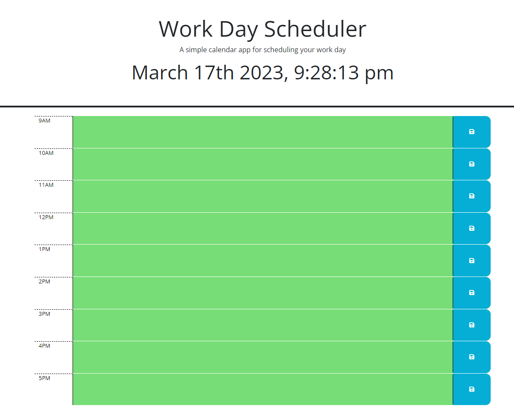

# <Work_Day_Scheduler>

## Description

This is a daily planner than can be used with your Local Storage to input your daily schedule.
It shows the date/time near the top.
You can track your schedule throughout the day with color-coordinated sections showing past, current, and future events in your schedule.
When you save your information within the boxes around the cooresponding time, you can save that information.

Deployed Application URL: https://animeet.github.io/API_Work_Day_Scheduler/

## Installation

N/A

## Usage

Use this Work Day Scheduler to make your day just a little easier with organization.
Start your day by putting your events for the day in the scheduler and use it as a reminder to see what is upcoming for the day.
Because it saves to your Local Storage, you can wipe it out each day, and start fresh with your to-do's for the current day listed at the top of the scheduler.
Throughout the day, the background color of the events will change from Green, Red, and Gray.

Green indicates the remaining times left in the day, with your upcoming future events scheduled.
Red indicates that you are within that specific current timezone. Be sure to look out for the event currently posted, or upcoming within the next hour.
Grey will indicate the event and timezone has already passed, and you no longer need to worry about that area.

## Credits

https://stackoverflow.com/questions/73565932/i-have-added-a-local-storage-function-but-it-doesnt-seem-to-work-on-my-scheduler

https://codepen.io/judebloom/pen/RwGbVWB

## License

Please refer to the LICENSE in the repository.